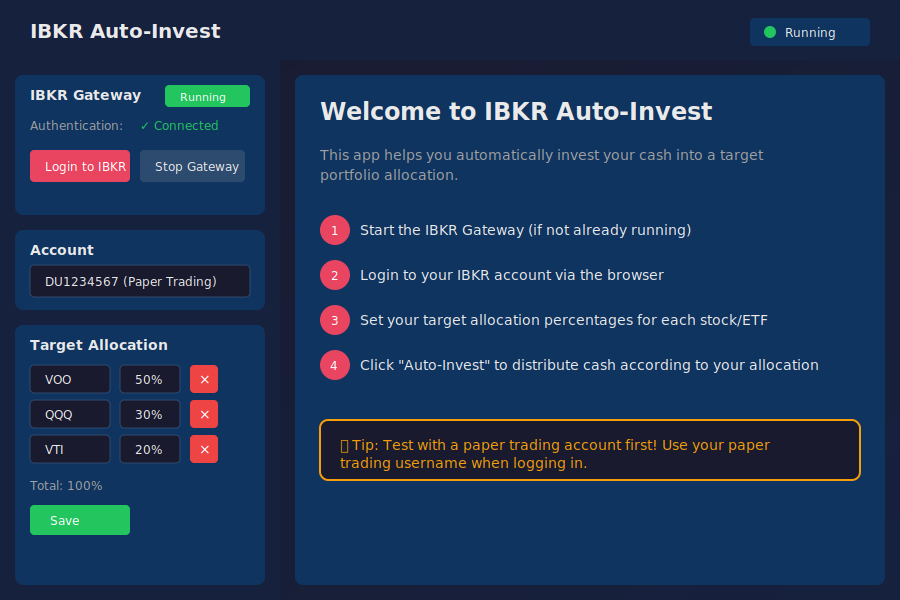
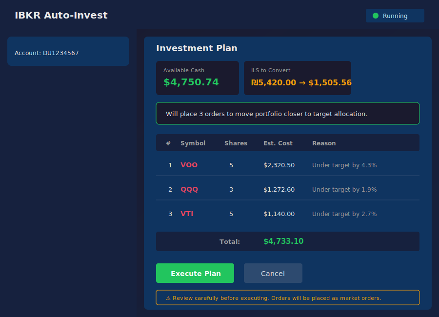
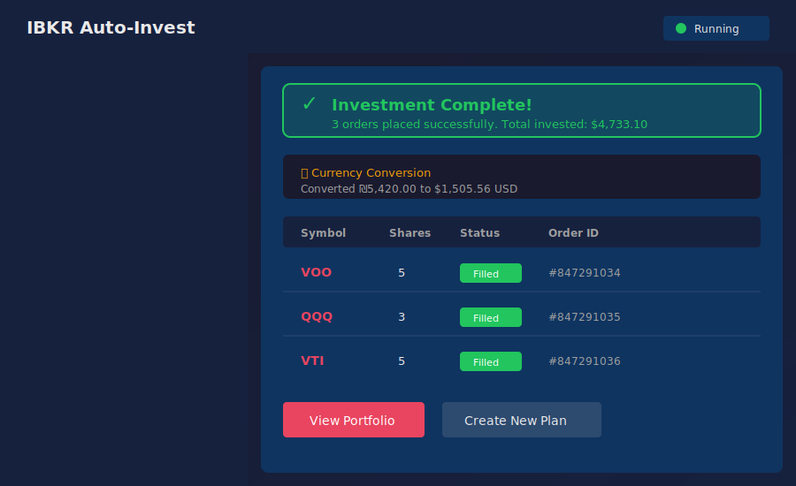

# IBKR Auto-Invest

A desktop application that automatically invests your available cash into a target portfolio allocation using Interactive Brokers.



## ✨ Features

- **Automatic Portfolio Rebalancing** – Define target allocation percentages for your stocks/ETFs and let the app calculate what to buy
- **ILS to USD Conversion** – Automatically converts Israeli Shekels to USD before investing (useful for Israeli investors)
- **Smart Order Prioritization** – Prioritizes purchases for positions that are furthest from their target allocation
- **Paper Trading Support** – Test safely with IBKR paper trading accounts before using real money
- **Built-in IBKR Gateway** – Manages the Client Portal Gateway automatically, no manual setup needed
- **Investment Plan Preview** – Review exactly what orders will be placed before executing

## 📸 Screenshots

### Portfolio Overview
View your current positions, cash balances, and how each position compares to your target allocation.


### Investment Plan
Before executing, review the planned orders with estimated costs and reasons for each trade.



### Execution Results
See the results of your auto-invest with order confirmations and any currency conversions performed.



## 🚀 How It Works

1. **Start the Gateway** – The app manages IBKR's Client Portal Gateway automatically
2. **Authenticate** – Login to your IBKR account via the secure browser authentication
3. **Set Target Allocation** – Define what percentage of your portfolio each stock/ETF should represent
4. **Create Investment Plan** – The app analyzes your portfolio and calculates optimal purchases
5. **Execute** – Place all orders with a single click (market orders)

## 🔧 Installation

### Prerequisites

- **Java 8+** or **OpenJDK 11+** – Required to run the IBKR Gateway
- **Interactive Brokers Account** – Live or paper trading account

### Download

Download the latest release for your platform from the [Releases](https://github.com/barakd/ibkr-auto-invest/releases) page:

- **macOS**: `.dmg` file
- **Windows**: `.exe` installer
- **Linux**: `.AppImage` or `.deb`

### Build from Source

```bash
# Clone the repository
git clone https://github.com/barakd/ibkr-auto-invest.git
cd ibkr-auto-invest

# Install dependencies
npm install

# Run in development mode
npm run dev

# Build for production
npm run build:mac    # macOS
npm run build:win    # Windows
npm run build:linux  # Linux
```

## 📖 Usage

### Setting Up Target Allocation

1. Add stocks/ETFs by entering their symbol (e.g., VOO, QQQ, VTI)
2. Assign a target percentage to each (must total ≤ 100%)
3. Click **Save** to persist your allocation

**Example allocation:**
| Symbol | Target % |
|--------|----------|
| VOO    | 50%      |
| QQQ    | 30%      |
| VTI    | 20%      |

### Auto-Invest Process

1. Click **Create Investment Plan**
2. The app will:
   - Calculate your total portfolio value
   - Identify which positions are below target
   - Calculate how many shares to buy for each
   - If you have ILS, plan a currency conversion
3. Review the plan and estimated costs
4. Click **Execute Plan** to place the orders

### Paper Trading

⚠️ **Recommended**: Test with paper trading first!

1. Use your IBKR paper trading username when logging in
2. The app works identically with paper accounts
3. Verify the behavior before using real funds

## ⚙️ Configuration

### Buffer Percentage

Set a buffer (default 5%) to avoid small trades. The app won't buy more of a position unless it's below target by more than the buffer percentage.

### Gateway Settings

The app includes IBKR's Client Portal Gateway. Configuration files are in:
- `resources/gateway/root/conf.yaml` – Main configuration
- Gateway runs on `https://localhost:5000` by default

## 🔒 Security

- **No credentials stored** – Authentication is handled through IBKR's secure web login
- **Local only** – The gateway only accepts connections from localhost
- **Your control** – All orders require explicit confirmation before execution

## 🛠️ Tech Stack

- **Electron** – Cross-platform desktop app
- **React + TypeScript** – Frontend UI
- **IBKR Client Portal API** – Brokerage integration
- **electron-store** – Persistent settings storage

## 📝 License

MIT License - see [LICENSE](LICENSE) for details.

## ⚠️ Disclaimer

This software is provided "as is" without warranty. Trading involves risk of financial loss. Always verify orders before execution and test thoroughly with paper trading. The authors are not responsible for any financial losses incurred through use of this software.

---

## Development

This project uses GitHub Actions for automated builds and releases.

### Creating a Release

1. Update the version in `package.json`
2. Commit your changes
3. Create and push a version tag:
   ```bash
   git tag v1.0.0
   git push origin v1.0.0
   ```
4. GitHub Actions will automatically:
   - Run linting and type checking
   - Run tests (if configured)
   - Build the app for Windows, macOS, and Linux
   - Create a GitHub Release with downloadable installers

### Manual Trigger

You can also trigger a build manually from the GitHub Actions tab using "workflow_dispatch".
